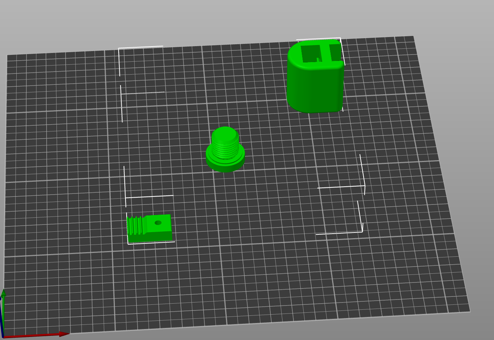
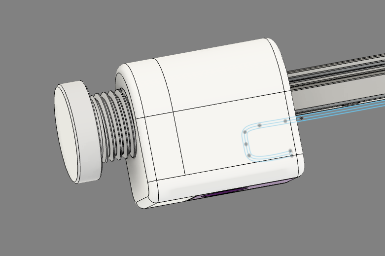
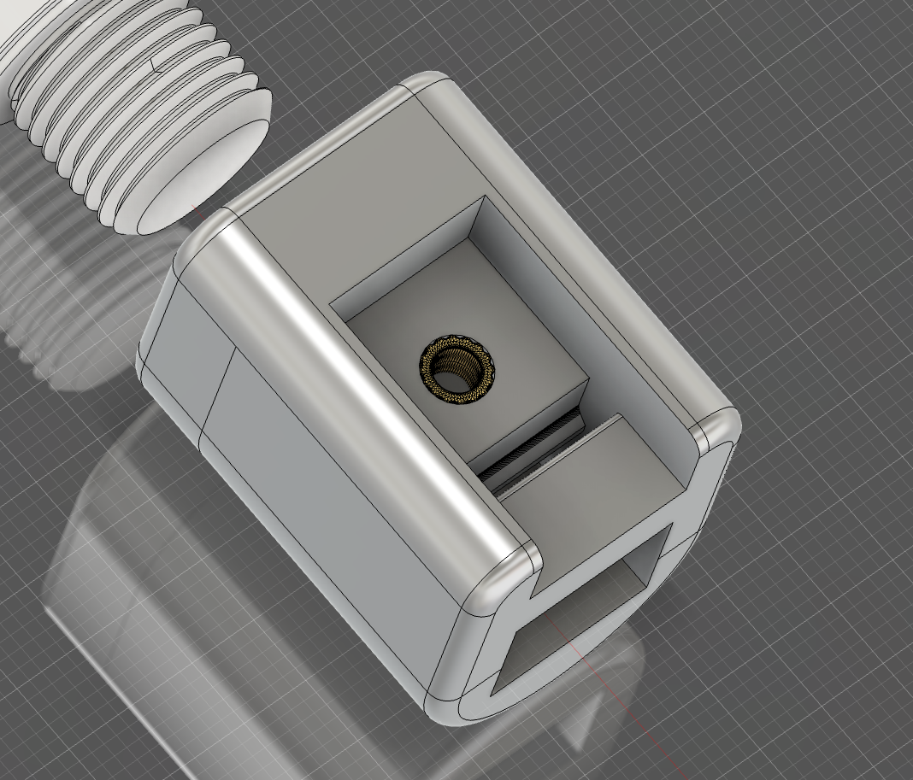

# Championship Edition Low Profile Belt Tensioner

## Print settings

- Tested with PLA+ @ 220C / 80mm default speed
- No supports
- Slow and hot = strong parts
- 5 perimeters
- 5 solid top/bottom layers
- 0.2mm layer height
- larger first layer is fine
- whatever infill

## Parts

- 1/4" BSPP Port Plug
  - This part is available on [Grainger](https://www.grainger.com/product/PARKER-Hollow-Hex-Head-Plug-Carbon-39A352) (#39A352).
  - The printed threads are kind of insane though and should work for most purposes

- M3x8mm bolt

- M3 washer (optional)

- M3 x 4mm x 5mm heat insert (Voron spec)

### STLs should load in the proper orientation, but please verify:

## Assembly

- Install the heat insert*

- Thread the belt through

- Slide the tensioner onto the rail

- Pull the belt tight

- Lock the belt into place with an M3x8mm bolt. An M3 washer is optional, but recommended

- Trim your belt. Leave a tiny bit sticking out to act as a bumper during homing

- I've been able to reinstall no problem with just 7mm of excess. I think shorter is possible but might require pliers to thread the belt through the block

### Heat Insert goes here

